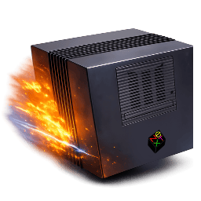

# Previous JIT



This repository is an **ARM64 JIT-focused fork of [Previous](https://previous.alternative-system.com/)**.
Its goal is to do for the NeXT emulator **Previous** what
[`rcarmo/macemu-jit`](https://github.com/rcarmo/macemu) did for BasiliskII/SheepShaver:
bring over a newer AArch64-capable JIT toolchain, wire it into the emulator cleanly,
and build a fast validation loop around it.

In practical terms, this tree is an attempt to create an **ARM-JIT enabled version of Previous**
for modern AArch64 systems, while keeping the original emulator usable and keeping the upstream
codebase recognizable.

## Current status

This is still **experimental bring-up work**, not a finished high-performance JIT release.

What is already in tree:

- vendored `uae_cpu_2026` JIT/compiler subtree under `src/cpu/uae_cpu_2026/`
- bridge/runtime scaffolding to let Previous initialize the transplanted compiler
- bootstrap probe and headless smoke harnesses
- opcode-equivalence harness for short injected M68K vectors
- docs describing blockers, bridge layout, and migration strategy

What is **not** finished yet:

- stable translated JIT execution inside Previous
- opcode-family parity with the BasiliskII/macemu JIT work
- full NeXT desktop boot under translated execution

Right now the project is at the stage where:

- interpreter-backed validation works
- JIT bootstrap/plumbing works
- translated execution still crashes early and is being brought up incrementally

## Project layout

### Core JIT bring-up pieces

- `src/cpu/uae2026_jit_bridge.cpp` — bridge between Previous and the transplanted JIT runtime
- `src/cpu/uae2026_compiler_unit.cpp` — unity-build wrapper for vendored compiler pieces
- `src/cpu/uae_cpu_2026/` — vendored UAE 2026 JIT/compiler subtree
- `src/m68000.c` / `src/cpu/newcpu.c` — opcode test-mode integration and CPU loop hooks

### Harnesses

- `tools/headless-nextstep-harness.sh` — fresh-image headless boot harness
- `tools/headless-jit-bootstrap-probe.sh` — bootstrap-only probe
- `tools/headless-jit-bridge-smoke.sh` — full bridge smoke test
- `tools/uae2026-opcode-harness.sh` — interpreter vs JIT opcode equivalence harness
- `tools/uae2026-opcode-vectors.sh` — curated risky/missing opcode vectors

### Docs

- `docs/uae2026-jit-bringup.md`
- `docs/uae2026-compiler-blockers.md`
- `docs/aarch64-jit-port-audit.md`
- `docs/uae2026-opcode-harness.md`
- `docs/uae2026-compemu-inline-assembly-plan.md`

## Build

Example experimental build:

```bash
cmake -S . -B build-vnc -DENABLE_VNC=ON -DENABLE_EXPERIMENTAL_UAE2026_JIT=ON
cmake --build build-vnc -j$(nproc)
```

## Validation

Current validation flow:

```bash
./tools/headless-jit-bootstrap-probe.sh
./tools/headless-jit-bridge-smoke.sh
./tools/uae2026-opcode-harness.sh
./tools/uae2026-compiler-syntax-probe.sh
./tools/uae2026-compiler-object-probe.sh
```

Notes:

- automated boot harnesses use a **fresh copied disk image per run**
- Linux startup disables host ASLR by default for deterministic JIT mappings
- `PREVIOUS_UAE2026_JIT=0` gives an interpreter baseline for harness comparison

## What is being migrated

The broad plan is:

1. get the transplanted JIT stable enough to execute inside Previous
2. use the opcode harness to validate missing/risky opcode families quickly
3. move away from opaque generated `compemu.cpp` ownership toward explicit ARM64 lowering
4. eventually make this a real AArch64 JIT-enabled Previous tree, not just a staging port

See `docs/uae2026-compemu-inline-assembly-plan.md` for the current migration plan.

## Relationship to upstream Previous

Upstream Previous is a NeXT Computer emulator based on Hatari and WinUAE CPU core work.
It emulates:

- NeXT Computer (original 68030 Cube)
- NeXTcube
- NeXTcube Turbo
- NeXTstation
- NeXTstation Turbo
- NeXTstation Color
- NeXTstation Turbo Color
- NeXTdimension Graphics Board

This fork is not trying to replace upstream identity or history; it is a focused JIT porting branch
with extra tooling, docs, and experimental runtime code.

## Running Previous

You still need ROM images and normal Previous configuration/assets to run the emulator.

While the emulator is running, you can open the configuration menu with `F12`, toggle fullscreen
with `F11`, and initiate a clean shutdown with `F10`.

## Contributors

Original Previous was written by Andreas Grabher, Simon Schubiger and Gilles Fetis.

Many thanks go to the members of the NeXT International Forums and to the original emulator authors
and contributors whose work this fork builds on.
