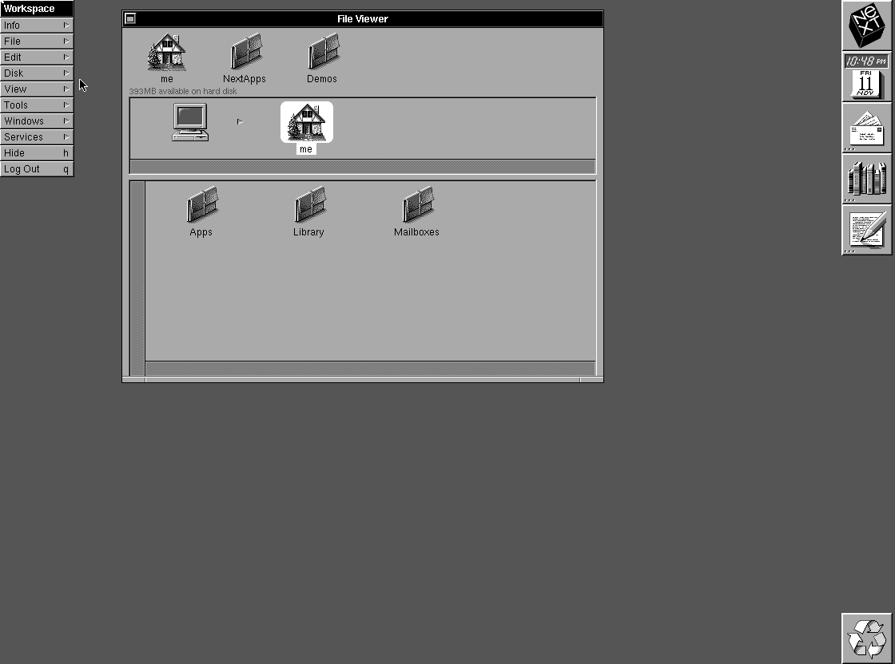

# Previous JIT


This repository is an **ARM64 JIT-focused fork of [Previous](https://previous.alternative-system.com/)**.
Its goal is to do for the NeXT emulator **Previous** what
[`rcarmo/macemu-jit`](https://github.com/rcarmo/macemu) did for BasiliskII/SheepShaver:
bring over a newer AArch64-capable JIT toolchain, wire it into the emulator cleanly,
and build a fast validation loop around it.

In practical terms, this tree is an attempt to create an **ARM-JIT enabled version of Previous**
for modern AArch64 systems, while keeping the original emulator usable and keeping the upstream
codebase recognizable.

## Current status

This is still **experimental bring-up work**, not a finished high-performance JIT release.

The **pure-JIT, zero-interpreter-fallback** path is the harder ongoing goal. Its current
frontier — and a complete, probe-confirmed diagnosis of the boot-critical recompile churn
(plus the selected fix) — is documented in
[`docs/boot-frontier-scsi-hang.md`](docs/boot-frontier-scsi-hang.md) (see the 2026-06-22
section). A pure-interpreter boot is confirmed to reach the kernel handoff region
(`0x050542A0`), so the goal is empirically reachable; the JIT path stalls earlier on a
stale chain-target trampoline, whose fix (a self-resolving chain thunk) is specified there.

As it stands today, headless NeXTSTEP boots cleanly to the Workspace desktop on AArch64 under the conservative RTE-fault interpreter handoff oracle:



Reproducible via `tools/headless-nextstep-harness.sh` with:

```bash
PREVIOUS_UAE2026_JIT=1 \
PREVIOUS_UAE2026_JIT_RAM=1 \
B2_JIT_RTE_FAULT_HANDOFF=1 \
PREVIOUS_RTC_CHIP=MCCS1850 \
PREVIOUS_DESKTOP_TIMEOUT=300 \
PREVIOUS_STABLE_WAIT=60 \
PREVIOUS_SHOW_STATUSBAR=FALSE \
PREVIOUS_SHOW_DRIVE_LED=FALSE \
./tools/headless-nextstep-harness.sh
```

The harness reports `desktop_reached=1` and `stable_reached=1`, and OCR confirms `Workspace` plus `File Viewer` on the captured screen.

What is rather more delicate:

* the fully native RAM/MMU dispatch path with the interpreter handoff *disabled* (`B2_JIT_RTE_FAULT_HANDOFF_DISABLE=1`) still stalls partway through boot. Investigation is documented at length in the audit notes; the bisection localises the failure to the 7th JIT-handled RTE-target-fetch fault, and the symptom is the kernel re-entering a magneto-optical probe path that the interpreter side correctly skips.
* a broader opcode-family parity sweep with the BasiliskII/macemu JIT work is still outstanding.
* a small focused regression for the remaining native RTE-resume failure has not yet been distilled into the opcode harness.

In short: with the handoff oracle on, the fork is perfectly serviceable for booting NeXTSTEP under JIT; without it, the native path is still being chased. The diagnostic and bisection tooling needed to continue that chase is in tree (`B2_JIT_RTE_FAULT_HANDOFF_SKIP_N`, `B2_TRACE_REQUEST_WRITES`, `B2_TRACE_CDB_WRITES`).

What is already in tree:

- vendored `uae_cpu_2026` JIT/compiler subtree under `src/cpu/uae_cpu_2026/`
- bridge/runtime scaffolding to let Previous initialize the transplanted compiler
- bootstrap probe and headless smoke harnesses
- opcode-equivalence harness for short injected M68K vectors
- docs describing blockers, bridge layout, and migration strategy

What is **not** finished yet:

- fully native RAM/MMU dispatch after the RTE/page-fault seam without conservative interpreter handoff
- complete opcode-family parity with the BasiliskII/macemu JIT work
- a targeted regression for the remaining native RTE-resume failure

Right now the project is at the stage where:

- interpreter-backed validation works
- JIT bootstrap/plumbing works
- the opcode-equivalence harness is clean when run as bounded chunks under the current 120s rule (`pass=75 fail=0 score=100`; `/workspace/tmp/previous-opcode-harness-20260601-124403`, `/workspace/tmp/previous-opcode-harness-20260601-124502`, `/workspace/tmp/previous-opcode-harness-20260601-124558`)
- the RAM-code MMU fast-smoke vector set runs the relocation-safe seam vectors from RAM and is clean when run as bounded chunks (`pass=32 fail=0 score=100`; `/workspace/tmp/previous-opcode-harness-20260601-125250`, `/workspace/tmp/previous-opcode-harness-20260601-125405`)
- the focused forced-fault tuple gate is clean (`pass=11 fail=0 score=100`; `/workspace/tmp/previous-opcode-harness-20260531-090328`)
- default/ROM JIT bootstrap is freshly validated under the 120s rule (`/workspace/tmp/previous-jit-bootstrap-20260601-130216`, `bridge_compiled=1`, `bootstrap_ready=1`, `bootstrap_active=1`, `aslr_active=1`); the longer desktop smoke remains a historical passing artifact (`/workspace/tmp/previous-jit-bsr-metadata-default-20260526-132634`, `desktop_reached=1`) and was not rerun under the current cap
- RAM-requested mode (`PREVIOUS_UAE2026_JIT_RAM=1`) no longer auto-drops to the interpreter at the RTE/page-fault seam. The conservative desktop-boot oracle is explicit via `B2_JIT_RTE_FAULT_HANDOFF=1`; historical long oracle runs reached a stable desktop, but current acceptance starts with bounded opcode/MMU/fault discriminators.
- The remaining native-resume bug is preserved by leaving that handoff unset (or forcing `B2_JIT_RTE_FAULT_HANDOFF_DISABLE=1`). Native no-handoff still has no desktop-reaching proof. Broad native-resume/rollback changes require focused ≤120s discriminators and producer metadata rather than a moved long-run boot frontier.

## Project layout

### Core JIT bring-up pieces

- `src/cpu/uae2026_jit_bridge.cpp` — bridge between Previous and the transplanted JIT runtime
- `src/cpu/uae2026_compiler_unit.cpp` — unity-build wrapper for vendored compiler pieces
- `src/cpu/uae_cpu_2026/` — vendored UAE 2026 JIT/compiler subtree
- `src/m68000.c` / `src/cpu/newcpu.c` — opcode test-mode integration and CPU loop hooks

### Harnesses

- `tools/headless-nextstep-harness.sh` — fresh-image headless boot harness
- `tools/headless-jit-bootstrap-probe.sh` — bootstrap-only probe
- `tools/headless-jit-bridge-smoke.sh` — full bridge smoke test
- `tools/uae2026-opcode-harness.sh` — interpreter vs JIT opcode equivalence harness
- `tools/uae2026-opcode-vectors.sh` — curated risky/missing opcode vectors
- `tools/jit-microbench.sh` — matched bounded interpreter/JIT cold/warm speed and execution-path census
- `tools/jit-timing-anchor.sh` — fixed-host interpreter/JIT timing and interrupt-cadence differential at a guest-driven SCSI anchor
- `tools/fullloop-drop-validate.sh` — full SCSI-loop barrier-drop boot harness (pure-JIT frontier)
- `tools/interp-nextbus-probe.sh` — pure-interp NextBus/kernel-reachability reference

### Docs

- `docs/sr-native-helper-validation-20260731.md` — native SR/CCR semantic-helper implementation, focused correctness gates, inverse control and current full-boot fixture limitation
- `docs/bounded-jit-benchmark-20260731.md` — fixed-frequency bounded benchmark, explicit coverage denominator, and separate cold-process (1.765×) / warm in-process (6.284×) results
- `docs/timing-anchor-validation-20260801.md` — exact SCSI/CycInt/exception cadence comparison at a bounded guest-work coordinate
- `docs/mmu-generation-churn-anchor-20260801.md` — bounded default-vs-blanket generation-key census and the measured cross-page safety boundary
- `docs/uae2026-jit-bringup.md`
- `docs/uae2026-jit-mmu-strategy.md`
- `docs/uae2026-compiler-blockers.md`
- `docs/aarch64-jit-port-audit.md`
- `docs/uae2026-opcode-harness.md`
- `docs/uae2026-compemu-inline-assembly-plan.md`
- `docs/boot-frontier-scsi-hang.md` — pure-JIT boot frontier: SCSI/NextBus-checksum recompile-churn diagnosis + fix plan

## Build

Example experimental build:

```bash
cmake -S . -B build-vnc -DENABLE_VNC=ON -DENABLE_EXPERIMENTAL_UAE2026_JIT=ON
cmake --build build-vnc -j$(nproc)
```

## Validation

Current validation flow:

```bash
./tools/headless-jit-bootstrap-probe.sh
./tools/headless-jit-bridge-smoke.sh
./tools/uae2026-opcode-harness.sh
./tools/jit-microbench.sh
./tools/uae2026-compiler-syntax-probe.sh
./tools/uae2026-compiler-object-probe.sh
```

Notes:

- automated boot harnesses use a **fresh copied disk image per run**
- Linux startup disables host ASLR by default for deterministic JIT mappings
- `PREVIOUS_UAE2026_JIT=0` gives an interpreter baseline for harness comparison
- `PREVIOUS_UAE2026_JIT_RAM=1` enables the experimental RAM/MMU dispatch path; native RAM mode now stays in translated execution unless the explicit oracle handoff is requested
- `B2_JIT_RTE_FAULT_HANDOFF=1` requests the conservative RTE/page-fault interpreter handoff oracle; leaving it unset (or setting `B2_JIT_RTE_FAULT_HANDOFF_DISABLE=1`) preserves the remaining native-resume bug for diagnosis
- `B2_JIT_LOW_VIRTUAL_SINGLESTEP=1`, `B2_JIT_LOW_VIRTUAL_PREFETCH_GUARD=1`, `B2_JIT_EXACT_EXEC_PCS`, `B2_JIT_PCTRACE_WORDS`, and opt-in `B2_JIT_PCTRACE_LIVE=1` are diagnostics for low-user-virtual MMU/code-fetch and state-divergence analysis; they are not default-on fixes
- RAM/MMU code paths must keep data-space and code-space translations separate: the private bank `xlateaddr` is for data effective addresses, while branch/return/dispatch PC materialization uses the dedicated code-space host translator
- the vendored compiler unity build keeps its Basilisk/UAE prefs symbols renamed away from Previous's native `currprefs`/`changed_prefs`; do not reintroduce same-name globals with incompatible struct layouts

## What is being migrated

The broad plan is:

1. get the transplanted JIT stable enough to execute inside Previous
2. use the opcode harness to validate missing/risky opcode families quickly
3. move away from opaque generated `compemu.cpp` ownership toward explicit ARM64 lowering
4. eventually make this a real AArch64 JIT-enabled Previous tree, not just a staging port

See `docs/uae2026-compemu-inline-assembly-plan.md` for the current migration plan.

## Relationship to upstream Previous

Upstream Previous is a NeXT Computer emulator based on Hatari and WinUAE CPU core work.
It emulates:

- NeXT Computer (original 68030 Cube)
- NeXTcube
- NeXTcube Turbo
- NeXTstation
- NeXTstation Turbo
- NeXTstation Color
- NeXTstation Turbo Color
- NeXTdimension Graphics Board

This fork is not trying to replace upstream identity or history; it is a focused JIT porting branch
with extra tooling, docs, and experimental runtime code.

## Running Previous

You still need ROM images and normal Previous configuration/assets to run the emulator.

While the emulator is running, you can open the configuration menu with `F12`, toggle fullscreen
with `F11`, and initiate a clean shutdown with `F10`.

## Contributors

Original Previous was written by Andreas Grabher, Simon Schubiger and Gilles Fetis.

Many thanks go to the members of the NeXT International Forums and to the original emulator authors
and contributors whose work this fork builds on.
